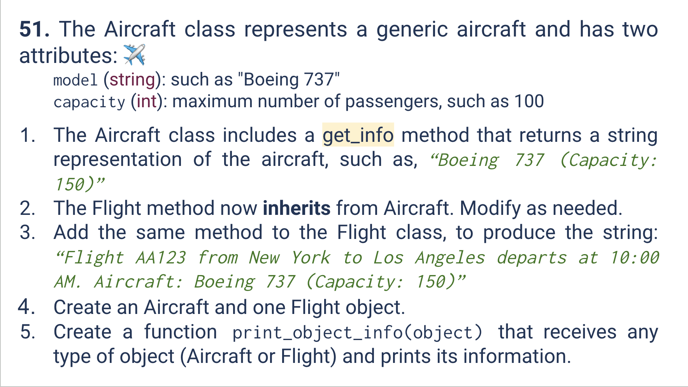
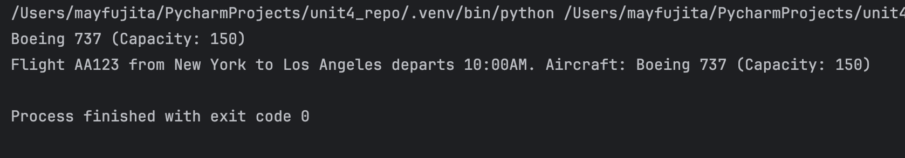
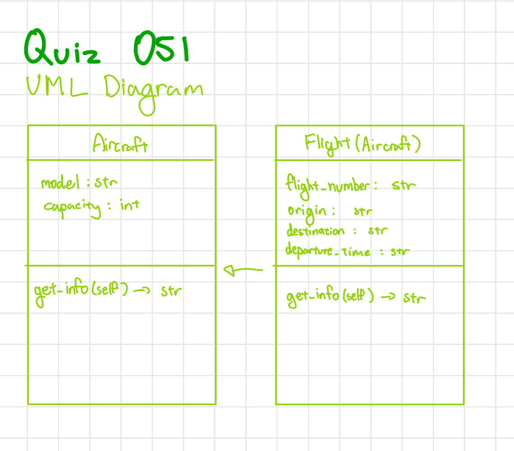

# Quiz 051
<hr>

### Prompt

*fig. 1* **Screenshot of quiz slides**

### Solution
```.py
class Aircraft:
    def __init__(self, model:str, capacity:int):
        self.model = model
        self.capacity = capacity

    def get_info(self):
        return f"{self.model} (Capacity: {self.capacity})"

class Flight(Aircraft):
    def __init__(self, model, capacity, flight_number, origin, destination, departure_time):
        super().__init__(model, capacity)
        # OVERWRITING
        self.flight_number = flight_number
        self.origin = origin
        self.destination = destination
        self.departure_time = departure_time

    def get_info(self):
        return f"Flight {self.flight_number} from {self.origin} to {self.destination} departs {self.departure_time}. Aircraft: {super().get_info()}"

def print_object_info(object):
    # POLYMORPHISM (object attribute can be of any form, the print function would still work for either class)
    if isinstance(object, Aircraft) or isinstance(object, Flight):
        print(object.get_info())
    else:
        print(f"{object} is not an object of class Aircraft or Flight")
        raise ValueError(Exception)
```

### Evidence

*fig. 2* **Screenshot of output in console**

### UML Diagram

*fig. 3* **UML Diagram for solution**