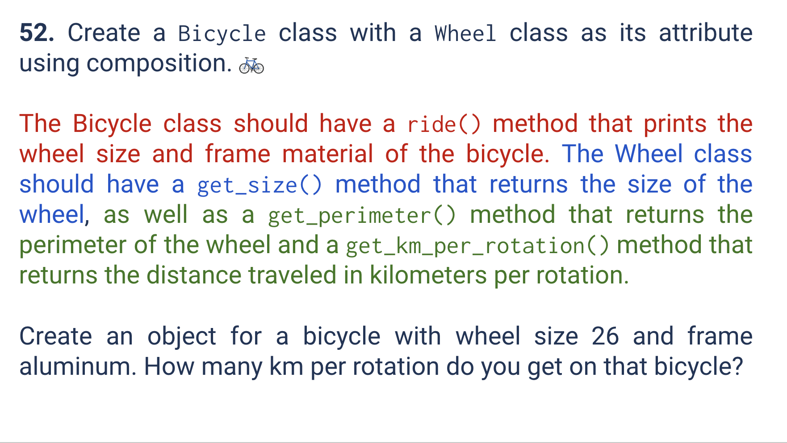
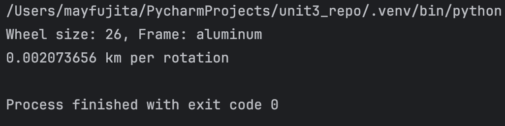
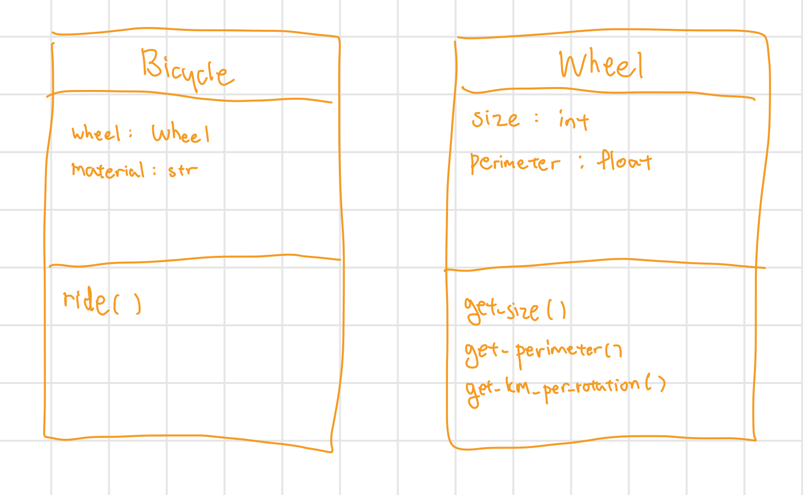

# Quiz 052
<hr>

### Prompt

*fig. 1* **Screenshot of quiz slides**

### Solution
```.py
class Bicycle:
    def __init__(self, wheel:Wheel, material:str):
        self.wheel = wheel
        self.material = material

    def ride(self):
        print(f"Wheel size: {self.wheel.size}, Frame: {self.material}")


MaysWheel = Wheel(26)
MaysBike = Bicycle(MaysWheel, 'aluminum')

MaysBike.ride()
print(MaysBike.wheel.get_km_per_rotation())
```

### Evidence

*fig. 2* **Screenshot of output in console**

### UML Diagram

*fig. 3* **UML Diagram for solution**