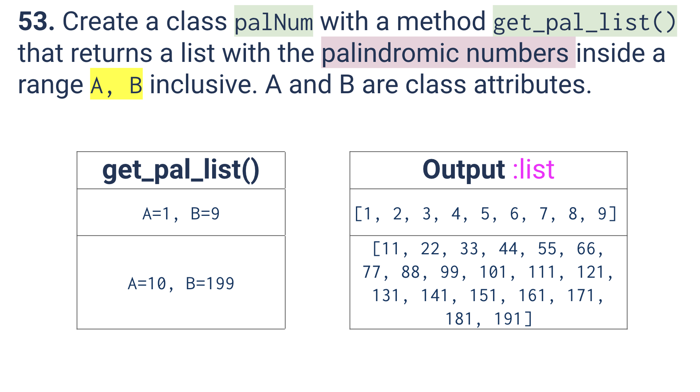
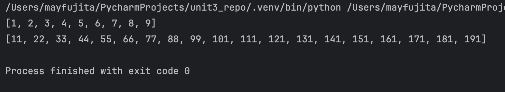
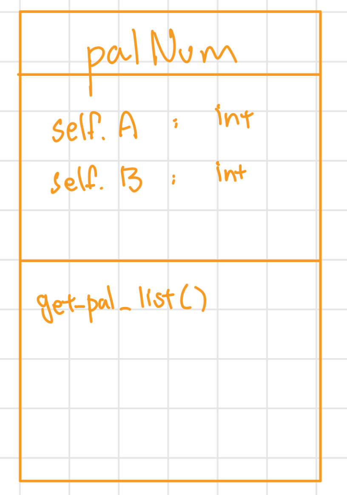

# Quiz 053
<hr>

### Prompt

*fig. 1* **Screenshot of quiz slides**

### Solution
```.py
class palNum:
    def __init__(self, A:int, B:int):
        self.A = A
        self.B = B
    def get_pal_list(self):
        output = []
        for n in range(self.A, (self.B + 1)):
            a = ""
            for let in str(n):
                a = let + a
            if str(n) == a:
                output.append(n)
        return output

test = palNum(1, 9)
print(test.get_pal_list())

test = palNum(10, 199)
print(test.get_pal_list())
```

### Evidence

*fig. 2* **Screenshot of output in console**

### UML Diagram

*fig. 3* **UML Diagram for solution**