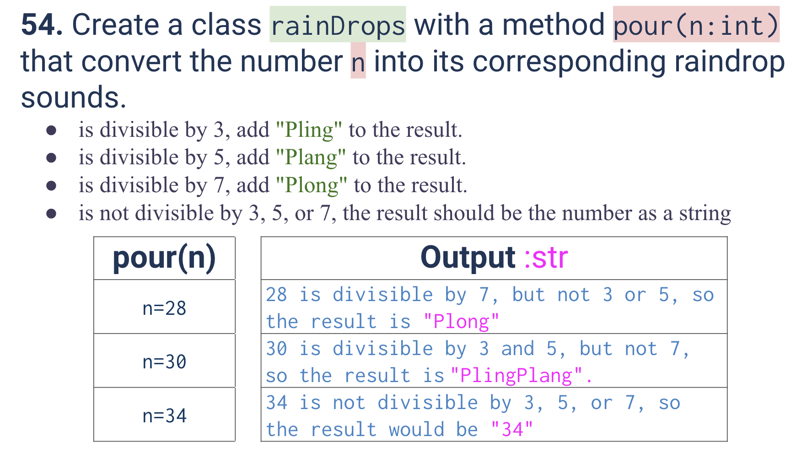
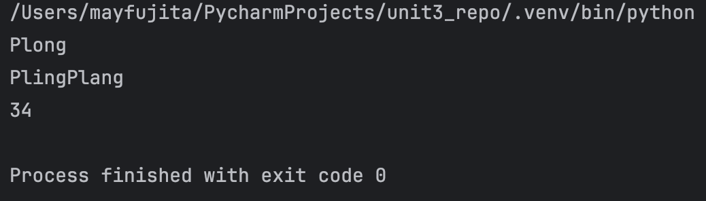
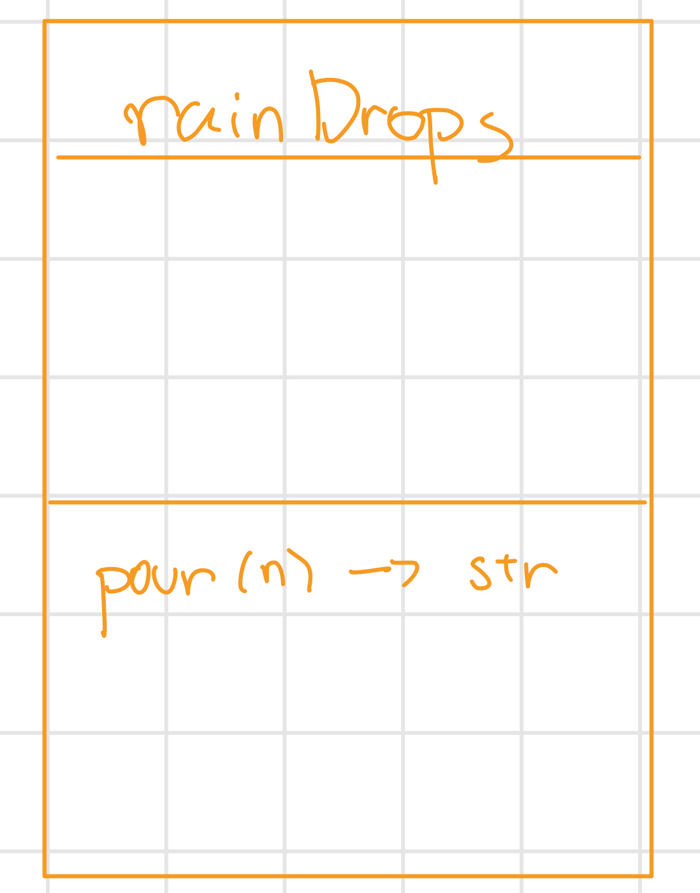

# Quiz 054
<hr>

### Prompt

*fig. 1* **Screenshot of quiz slides**

### Solution
```.py
class rainDrops:
    def pour(n:int) -> str:
        out = ''
        d = {3:'i', 5:'a', 7:'o'}
        for k,v in d.items():
            out += (n%k==0)* (f'Pl{v}ng')
        out += (len(out)==0) * str(n)
        return out

# Check that it works
test = rainDrops
print(test.pour(n=28))
print(test.pour(n=30))
print(test.pour(n=34))
```

### Evidence

*fig. 2* **Screenshot of output in console**

### UML Diagram

*fig. 3* **UML Diagram for solution**