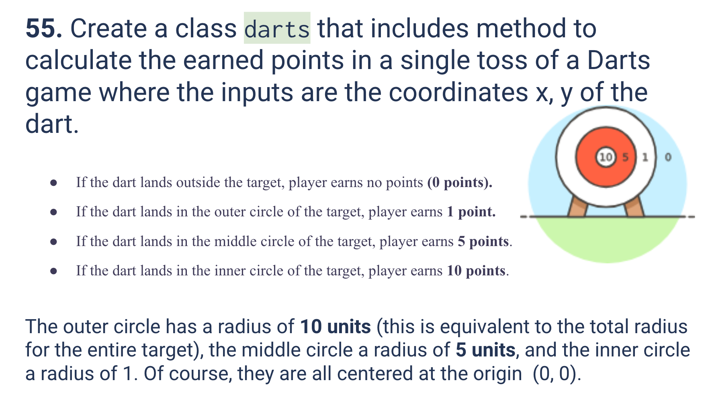
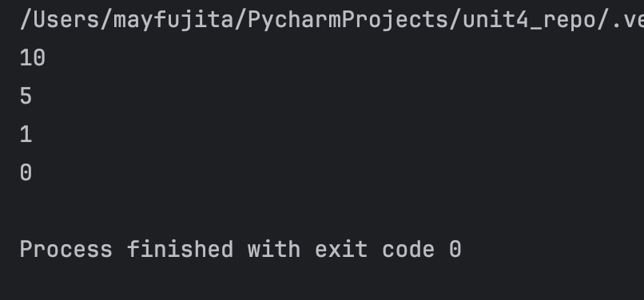
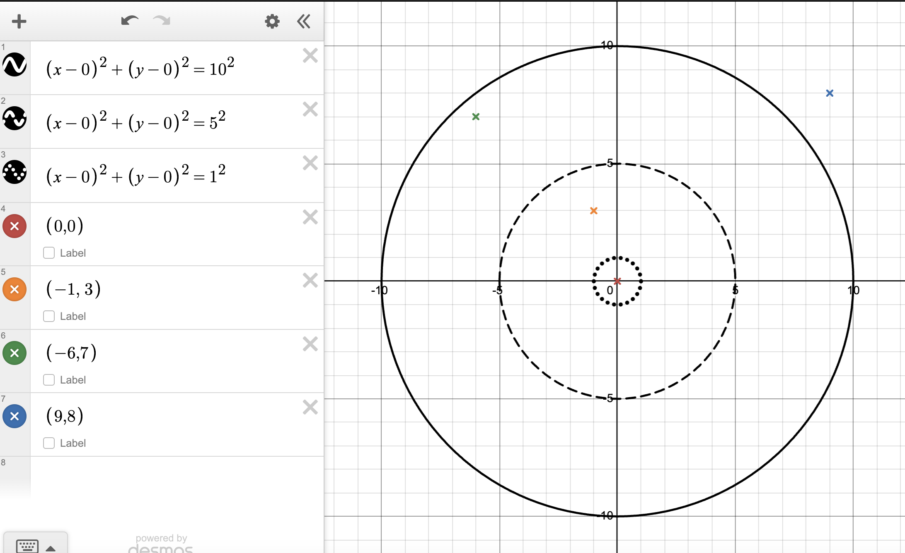
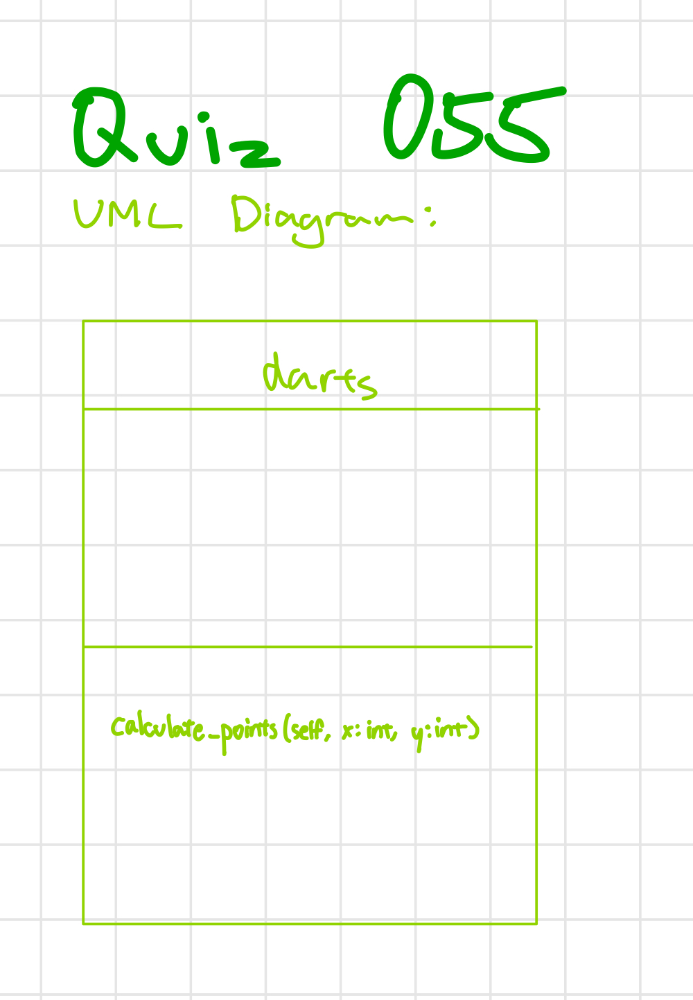

# Quiz 055
<hr>

### Prompt

*fig. 1* **Screenshot of quiz slides**

### Solution
```.py
class darts():
    def calculate_points(self, x: int, y: int) -> int:
        d = (x ** 2 + y ** 2) ** 0.5  # distance from center, using pythagorean theorem
        if d <= 1:  # distance from center is less than 1 (radius of inner circle)
            points = 10
        elif d <= 5:  # distance from center is less than 5 (radius of middle circle)
            points = 5
        elif d <= 10:  # distance from center is less than 10 (radius of target)
            points = 1
        else:
            points = 0  # distance from center is more than 10 (outside target)
        return points


# Check that it works
test = darts()
print(test.calculate_points(0, 0))
print(test.calculate_points(-1, -3))
print(test.calculate_points(4, -2))
print(test.calculate_points(9, 8))
```

### Evidence

*fig. 2* **Screenshot of output in console**

*fig. 3* **Screenshot of desmos, where the target and tested points are graphed**

### UML Diagram

*fig. 3* **UML Diagram for solution**