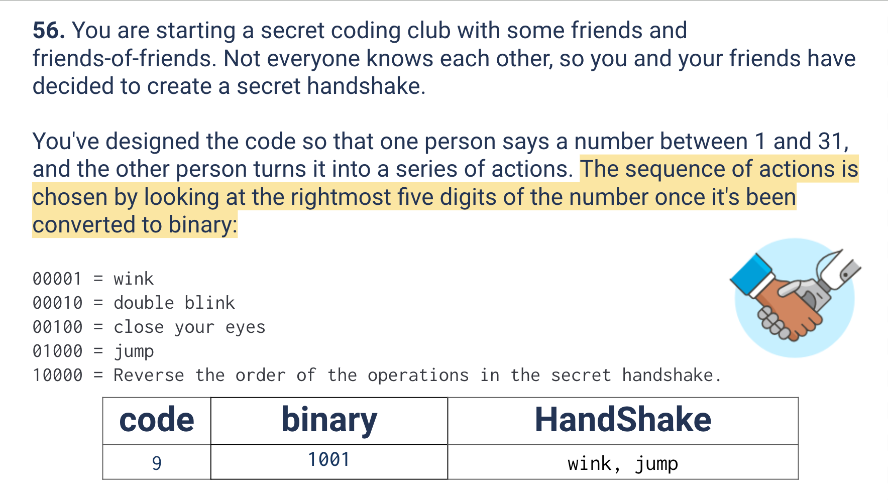

# Quiz 056
<hr>

### Prompt

*fig. 1* **Screenshot of quiz slides**

### Solution
```.py
# To Binary Conversion
def to_bin(n: int):
    output = ""
    while n > 1:
        output += str(n % 2)
        n = n // 2
    output += str(n)
    output = output[::-1]
    return output


# Create handshake
def create_handshake(code: int) -> str:
    code = to_bin(code)
    output = []
    rules = {1: "wink",
             2: "double blink",
             3: "close your eyes",
             4: "jump",
             5: "reverse"}
    for i in range(len(code)):  # max code of 31 is 11111 with 5 digits
        if code[-(i+1)] == "1":
            output.append(rules[i+1])
    if output[-1] == "reverse":
        output.pop()
        output.reverse()
    return ", ".join(output)


# Check that it works
print(to_bin(9))
print(create_handshake(9))
```

### Evidence

*fig. 2* **Screenshot of output in console**

### Flow Diagram

*fig. 3* **UML Diagram for solution**