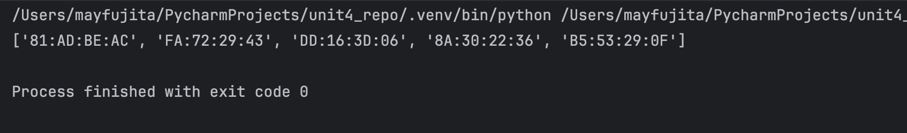

# Quiz 071
<hr>

### Prompt

*fig. 1* **Screenshot of quiz slides**

### Solution
```.python
import random

def macGenerator(N:int) -> list[str]:
    hex = '0123456789ABCDEF'
    output = []
    for i in range(N):
        address = []
        for n in range(4):
            digit = hex[random.randint(0, 15)] + hex[random.randint(0, 15)]
            address.append(digit)
        output.append(':'.join(address))
    return output

# Test that it works
print(macGenerator(5))
```

### Evidence

*fig. 2* **Screenshot of working/solution**